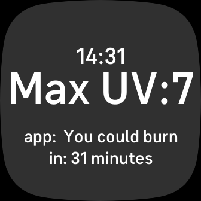

# UVwatch - Fitbit App

UVwatch is a Fitbit app that allows users to get the UV index from their current location, helping them understand the intensity of UV radiation. With this information, users can make informed decisions about sun protection and manage their sun exposure to avoid sunburn and promote safe tanning.
The idea came when I had a Fitbit myself and used UVlens before but having the possibility to see the information on your watch is even more accessible.

## Features

- Real-time UV index display based on your location.
- Personalized recommendations for sunscreen application based on the UV index. (TO-DO)
- User-friendly interface with intuitive controls for easy navigation.

## Installation

UVwatch is available for download on the Fitbit Gallery. You can install it on your Fitbit device by following this [link](https://gallery.fitbit.com/details/c98bdadd-858d-4f59-aa14-1d2dae6522a6).

## Screenshots

## How It Works

UVwatch uses the GPS data from your Fitbit device or your phones companion app to determine your current location. It then fetches the UV index data from a reliable external source and displays it on your Fitbit screen. The app also provides recommendations for sunscreen application based on the UV index, helping you protect your skin effectively.

## Requirements

- A compatible Fitbit device. (Depending on the use I can build it for more devices. Currently specifically testing with the Versa 3)
- Location services enabled on your Fitbit device or phone.
- Internet connectivity to fetch the UV index data (once every day as the data is cached till the end of the day).

## Contributing

We welcome contributions to enhance the UVwatch app. If you want to contribute to the project, follow these steps:

1. Fork the repository on GitHub.
2. Create a new branch with a descriptive name (`git checkout -b feature/your-feature-name`).
3. Make your changes and commit them (`git commit -m "Add feature"`)
4. Push your changes to the branch on your forked repository (`git push origin feature/your-feature-name`).
5. Open a Pull Request, describing the changes you've made and the rationale behind them.

## License

This project is open-source and available under the [MIT License](LICENSE).

## Contact

If you have any questions or feedback, feel free to contact the developer:

- Developer: [Paul H](https://github.com/GitStudying)
- Email: pg95tkak@anonaddy.me
- Website: https://github.com/GitStudying/UV-Watch